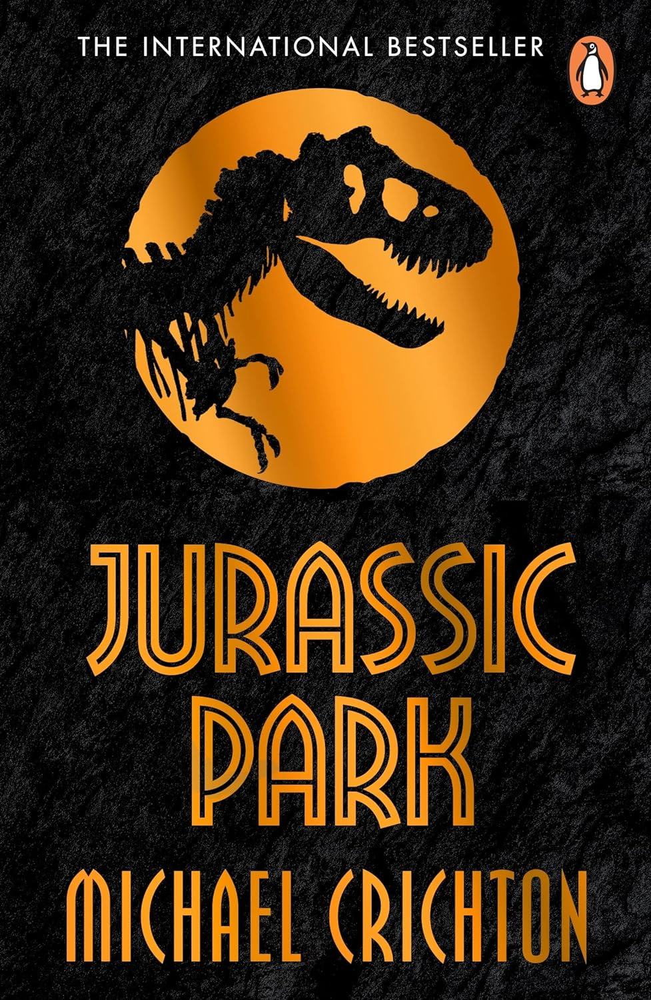
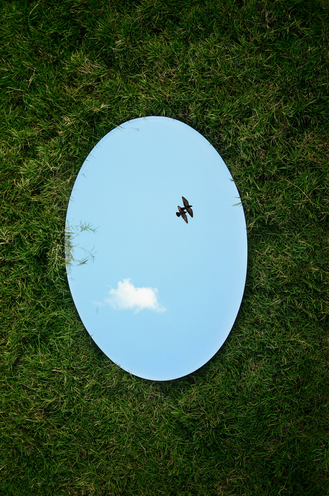

## 

```{=html}
<iframe allowfullscreen frameborder="0" height="80%" mozallowfullscreen style="min-width: 500px; min-height: 355px" src="https://app.wooclap.com/events/FUZIGY/questions/69e5f1815dfd55c323cde953" width="100%"></iframe>
```

## Built-in control

<br><br><br>

::: {.callout-tip appearance="minimal" style="text-align: right; font-size: 56px;"}
"But scientific power is like inherited wealth: attained without discipline. You read what others have done, and you take the next step. You can do it very young. You can make progress very fast. There is no discipline lasting many decades. There is no mastery: old scientists are ignored. There is no humility before nature."
:::

## 

::: {layout-ncol="2" style="text-align:center;"}
{fig-align="center" width="400"}

{fig-align="center" width="400"}
:::

##  {background-image="../img/ux-indonesia-qC2n6RQU4Vw-unsplash.jpg"}

::: aside
[Photo by <a href="https://unsplash.com/@uxindo?utm_source=unsplash&utm_medium=referral&utm_content=creditCopyText">UX Indonesia</a> on <a href="https://unsplash.com/photos/person-writing-on-white-paper-qC2n6RQU4Vw?utm_source=unsplash&utm_medium=referral&utm_content=creditCopyText">Unsplash</a>]{style="font-size: 8px;"}
:::

##  {background-image="../img/alex-shute-bGOemOApXo4-unsplash.jpg"}

::: aside
[Photo by <a href="https://unsplash.com/@faithgiant?utm_source=unsplash&utm_medium=referral&utm_content=creditCopyText">Alex Shute</a> on <a href="https://unsplash.com/photos/a-wooden-block-that-says-trust-surrounded-by-blue-flowers-bGOemOApXo4?utm_source=unsplash&utm_medium=referral&utm_content=creditCopyText">Unsplash</a>]{style="font-size: 8px;"}
:::

## 

:::::::: columns
::: {.column width="40%"}
{width="100%" fig-align="center"}
:::

:::::: {.column width="60%"}
::: r-fit-text
"A crisis of **confidence**?" [@pashler2012]{.small-ref}
:::

<br><br><br>

::: {.fragment .r-fit-text style="text-align: center;"}
**Research crises**
:::

::: {.fragment .r-fit-text}
Part of the **polycrisis** [@morin1999, @tooze2023]{.small-ref}
:::
::::::
::::::::

::: aside
[Photo by <a href="https://unsplash.com/@helloimnik?utm_source=unsplash&utm_medium=referral&utm_content=creditCopyText">Nik</a> on <a href="https://unsplash.com/photos/red-text-on-black-background-0urrnqA66Lo?utm_source=unsplash&utm_medium=referral&utm_content=creditCopyText">Unsplash</a>]{style="font-size: 8px;"}
:::

## Research reliability

.](/img/reproducible-matrix-d15700202901e2e2e85fd2dcc71a158b.jpg){fig-align="center"}

## Research reliability

.](/img/reproducible-matrix-d15700202901e2e2e85fd2dcc71a158b-2.jpg){fig-align="center"}

##  {.center background-image="../img/dusan-veverkolog-mX2mdxhc0UM-unsplash.jpg"}

::: {.r-fit-text style="color: white;"}
**SOUND**
:::

::: aside
[Photo by <a href="https://unsplash.com/@veverkolog?utm_source=unsplash&utm_medium=referral&utm_content=creditCopyText">Dušan veverkolog</a> on <a href="https://unsplash.com/photos/gray-stacked-stones-photo-mX2mdxhc0UM?utm_source=unsplash&utm_medium=referral&utm_content=creditCopyText">Unsplash</a>]{style="font-size: 8px;"}
:::

## Reproducibility

```{=html}
<iframe allowfullscreen frameborder="0" height="80%" mozallowfullscreen style="min-width: 500px; min-height: 355px" src="https://app.wooclap.com/events/FUZIGY/questions/69e60db0a236a202e88cd664" width="100%"></iframe>
```

## Reproducibility: shareability

{fig-align="center"}

## Reproducibility

{fig-align="center"}

## Reproducibility: qualitative research

::: {.callout-note appearance="simple"}
- @dubois2024: 96% surveyed qualitative researchers have never shared data in a repository.

- @lamb2024: claiming that data collector is the only legitimate knowledge gatekeeper is at odds with epistemic plurality.

- @heaton2008: shows successful reuse of qualitative data.
  Data are not epistemically exhausted by first analysis.
:::

## Replicability

{fig-align="center"}

## Robustness

::: {.callout-note appearance="simple"}
- @brodeur2026: economy and political science; effect sizes that are between 50% to 200% of the original effect size under reanalysis represent 69% of the sample.

- @auspurg2025: not invariance across all methods, but insensitivity within a justified class of models.
:::

## Generalisability

:::: {.callout-note appearance="simple"}
- **Uninterpretability** of conceptual models @meehl1990

- "We are not even wrong" @scheel2022

- Lack of meaningful **connection** between verbal generalisations and evidence.
  @yarkoni2022

- Replicable results do not imply correct conditional inference and non-replicable results do not imply incorrect conditional inference.
  @devezer2019
::::

## Researcher's orientation

:::::: columns
:::: {.column width="50%"}
::: {.callout-note appearance="simple"}
**Reflexive** understanding of one's own individual aspects and how they shape one's own approach to and practice of research.

<br>

Not limited to: identity, lived experiences, social positionality, philosophical stance, personal beliefs, methodological theory, and more.
:::
::::

::: {.column width="50%"}

:::
::::::

{.absolute top=0 right=0 height="100%"}

::: aside
[Photo by <a href="https://unsplash.com/@jovisjoseph?utm_source=unsplash&utm_medium=referral&utm_content=creditCopyText">Jovis Aloor</a> on <a href="https://unsplash.com/photos/a-bird-flying-in-the-sky-through-a-circular-mirror-4YxXWYW7JqQ?utm_source=unsplash&utm_medium=referral&utm_content=creditCopyText">Unsplash</a>]{style="font-size: 8px;"}
:::

## Researcher's orientation: resources

::: {.callout-note appearance="simple"}
**Positionality**

- @darwinholmes2020, @goundar2025 for qualitative research.

- @jafar2018, @lazard2020 for quantitative research.

<br>

**Philosophical stance**

- @okasha2016, @rosenberg2020

- @tomlinson2023, @castanelli2024 for PhD/ECRs.
:::

## Open Research {background-image="../img/deniz-demir-VRujFIBHhU4-unsplash.jpg" background-size=contain background-color="black"}

::: columns
::: {.column width="70%"}

::: callout-note
## What is it?
:::

Open Research is a movement that stresses the importance of a **more honest and transparent research** by promoting a series of research principles and by warning about common, although not necessarily intentional, questionable practices and misconceptions [@munafo2017, @cruwell2019]{.small-ref}

:::
:::

::: aside
[Photo by <a href="https://unsplash.com/@denizdowntown?utm_source=unsplash&utm_medium=referral&utm_content=creditCopyText">Deniz Demir</a> on <a href="https://unsplash.com/photos/a-neon-open-sign-glows-in-the-darkness-VRujFIBHhU4?utm_source=unsplash&utm_medium=referral&utm_content=creditCopyText">Unsplash</a>]{style="font-size: 8px;"}
:::

## Open Research {background-image="../img/deniz-demir-VRujFIBHhU4-unsplash.jpg" background-size=contain background-color="black"}

::: columns
::: {.column width="70%"}

::: callout-note
## How to make your research open?
:::

- Curate and share **Research compendia**.

- Use **version control**.

- Write **Registered Reports**.

- Reflect on your **researcher's orientation** [@liljedahl2025].

- Guidelines for PhD students/supervisors: @kathawalla2021.

:::
:::


::: aside
[Photo by <a href="https://unsplash.com/@denizdowntown?utm_source=unsplash&utm_medium=referral&utm_content=creditCopyText">Deniz Demir</a> on <a href="https://unsplash.com/photos/a-neon-open-sign-glows-in-the-darkness-VRujFIBHhU4?utm_source=unsplash&utm_medium=referral&utm_content=creditCopyText">Unsplash</a>]{style="font-size: 8px;"}
:::


## References
