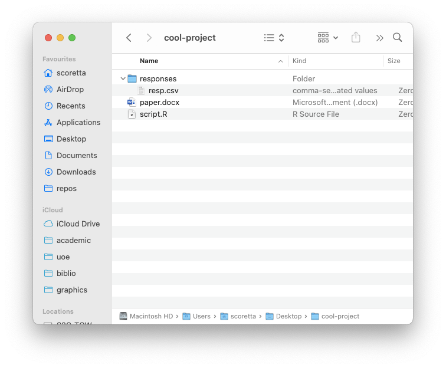
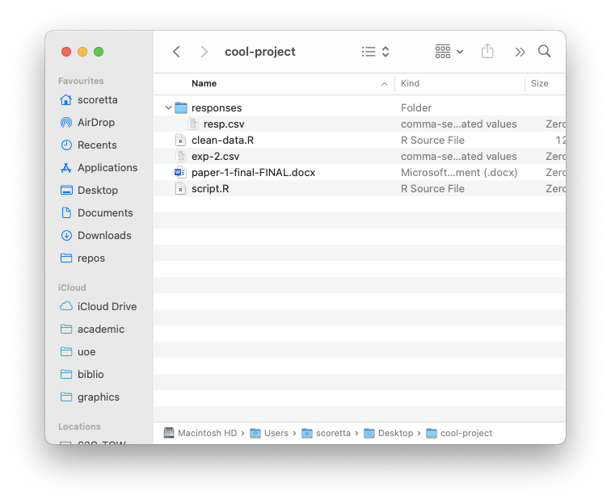
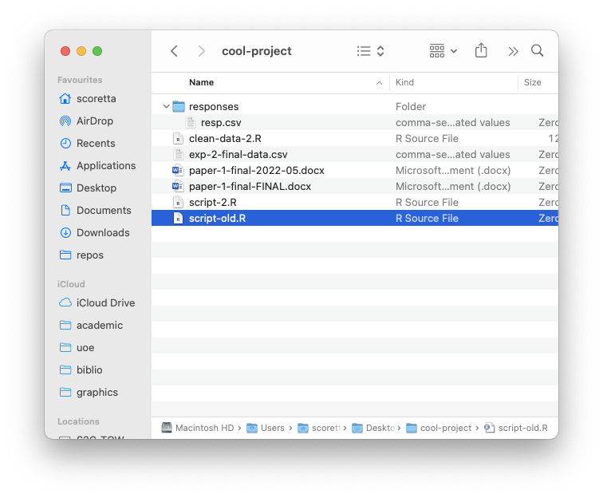
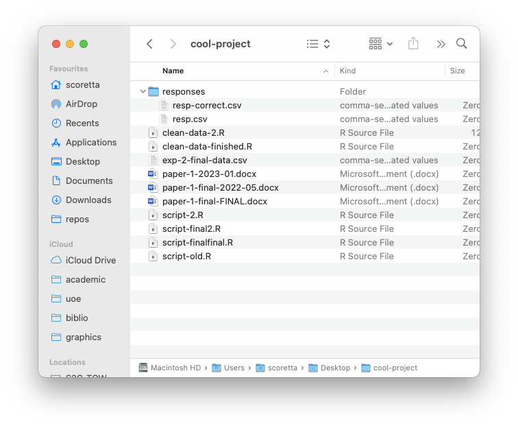
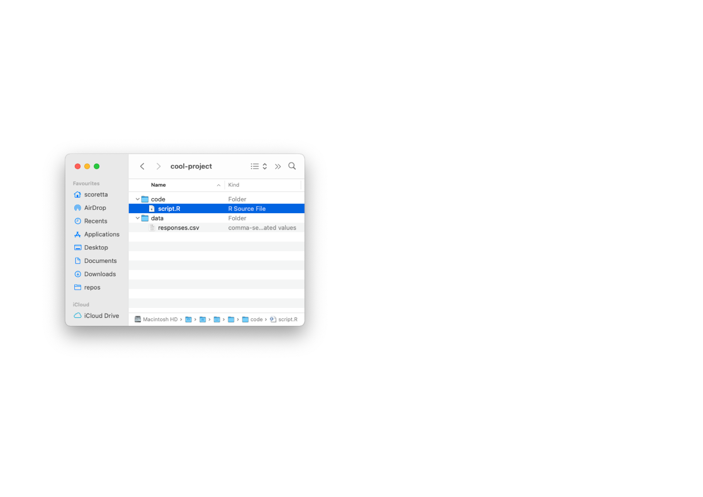
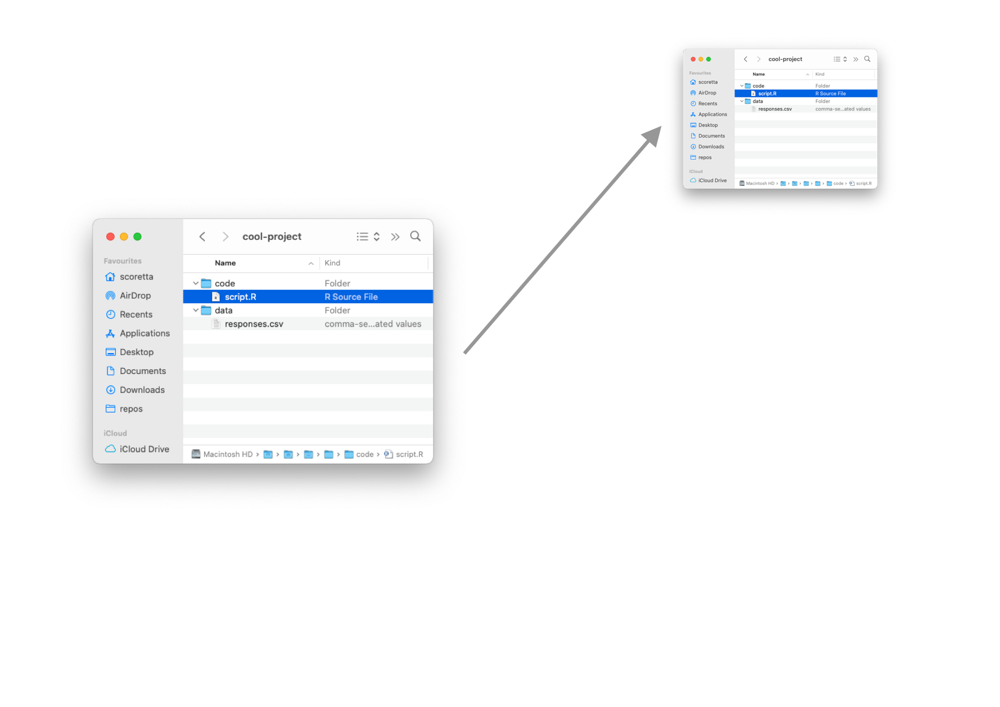
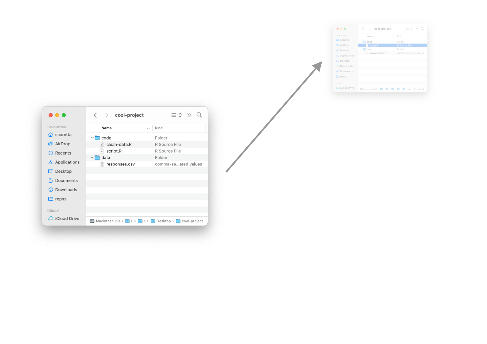
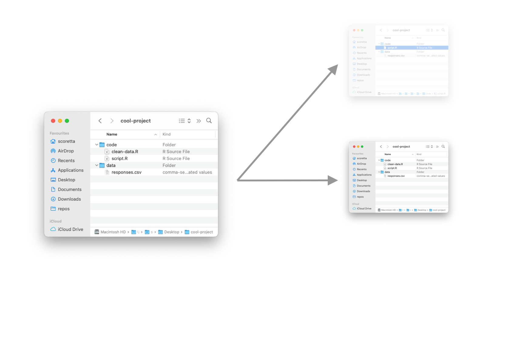
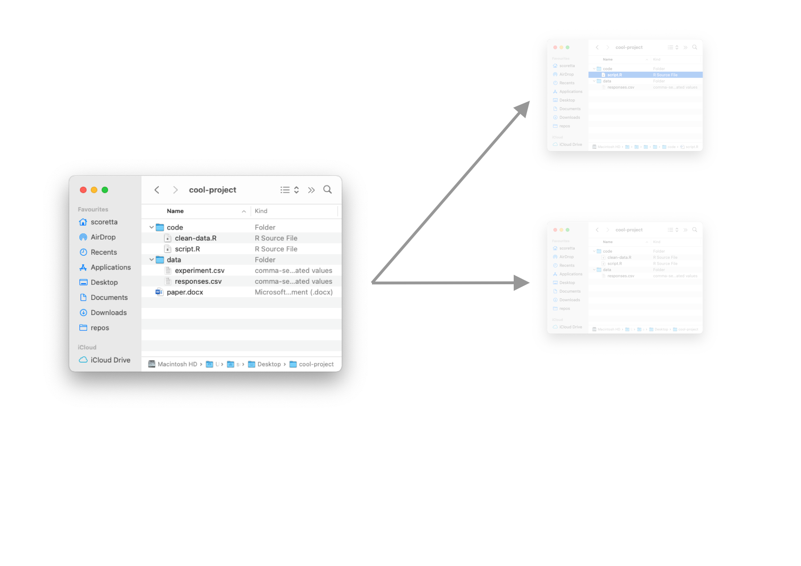
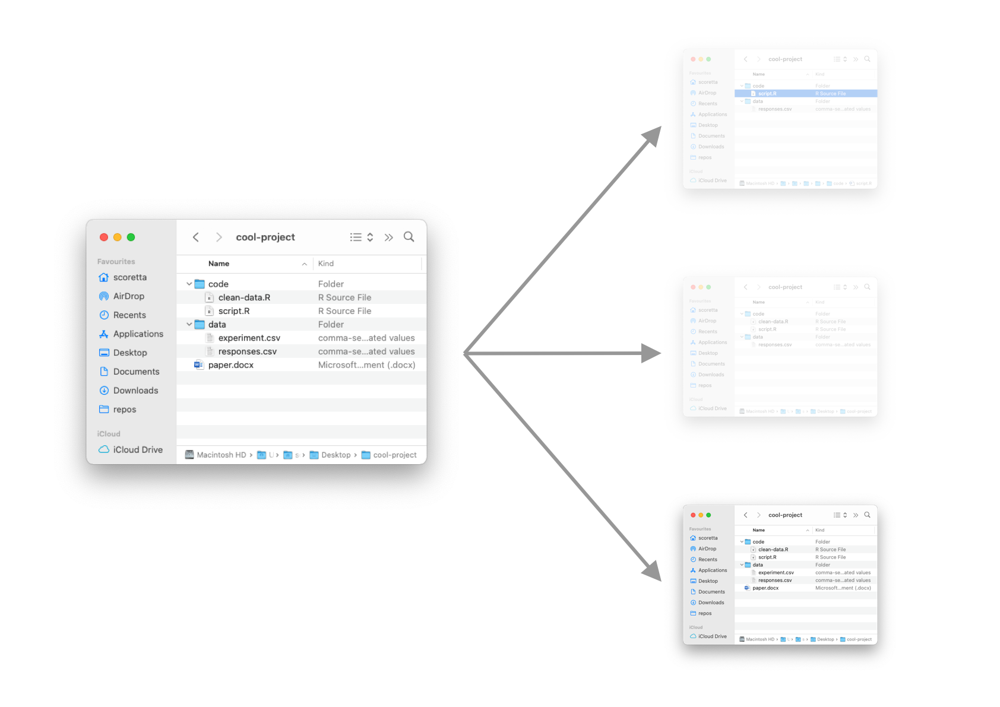

## Why should you learn version control? {background-color=var(--inverse) .center}

## 

{fig-align="center"}

## 

{fig-align="center"}

## 

{fig-align="center"}

## 

{fig-align="center"}

## How does version control work? {background-color=var(--inverse) .center}

## Version 1

{fig-align="center"}

## Version 1 snapshot

{fig-align="center"}

## Version 2

{fig-align="center"}

## Version 2 snapshot

{fig-align="center"}

## Version 3

{fig-align="center"}

## Version 3 snapshot

{fig-align="center"}

## The versioning system `git`

::: {.callout-note appearance="simple"}
git <https://git-scm.com>

- `git` is a very popular choice for **software development**.

- Tailored for tracking changes in software files.

- But, also useful with anything that is text-based (like analysis scripts, papers, dissertations, ...).
:::

## What can `git` do for you?

::: {.callout-note appearance="simple"}
- Keep track of **new or deleted files** in a project.

- Keep track of **changes to individual files** in a project.

  - Done on a line-by-line basis.

- Roll **back to a previous version** of the project or files.

- Make **back-ups of** your files.
:::

## DEMO {background-color=var(--inverse) .center}

## Practice {background-color=var(--inverse) .center}
