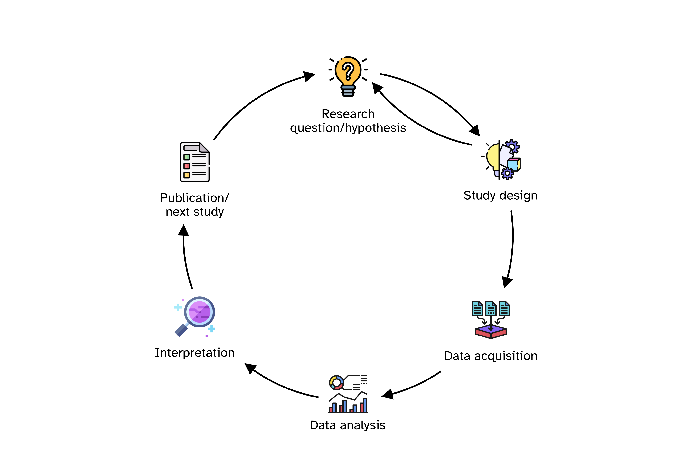
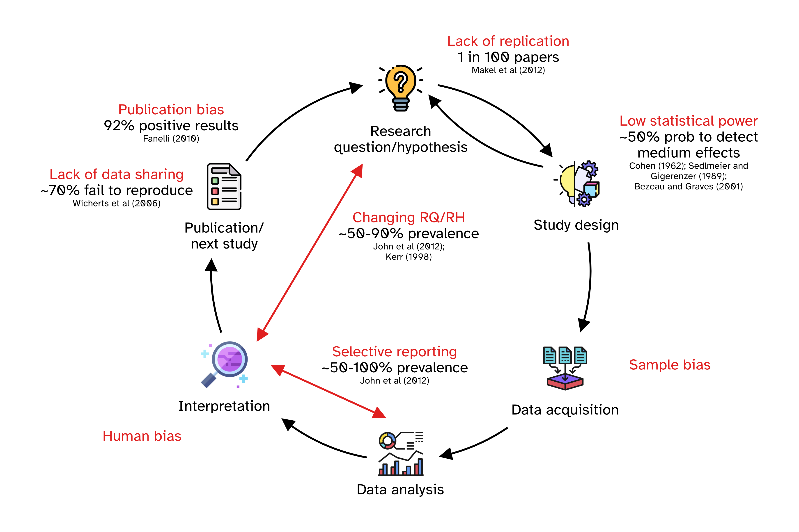
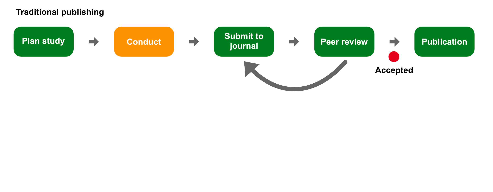
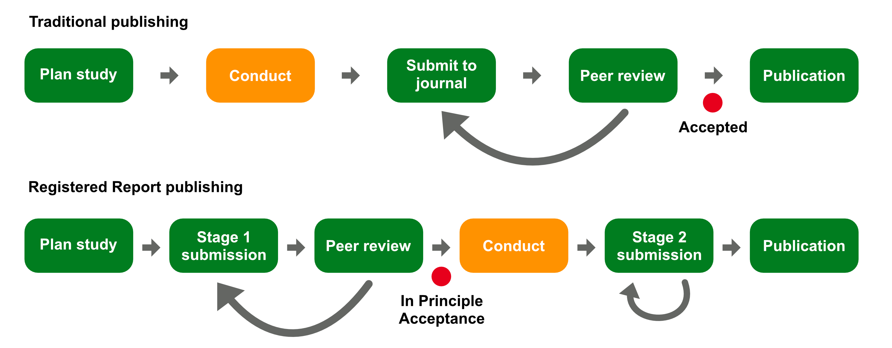
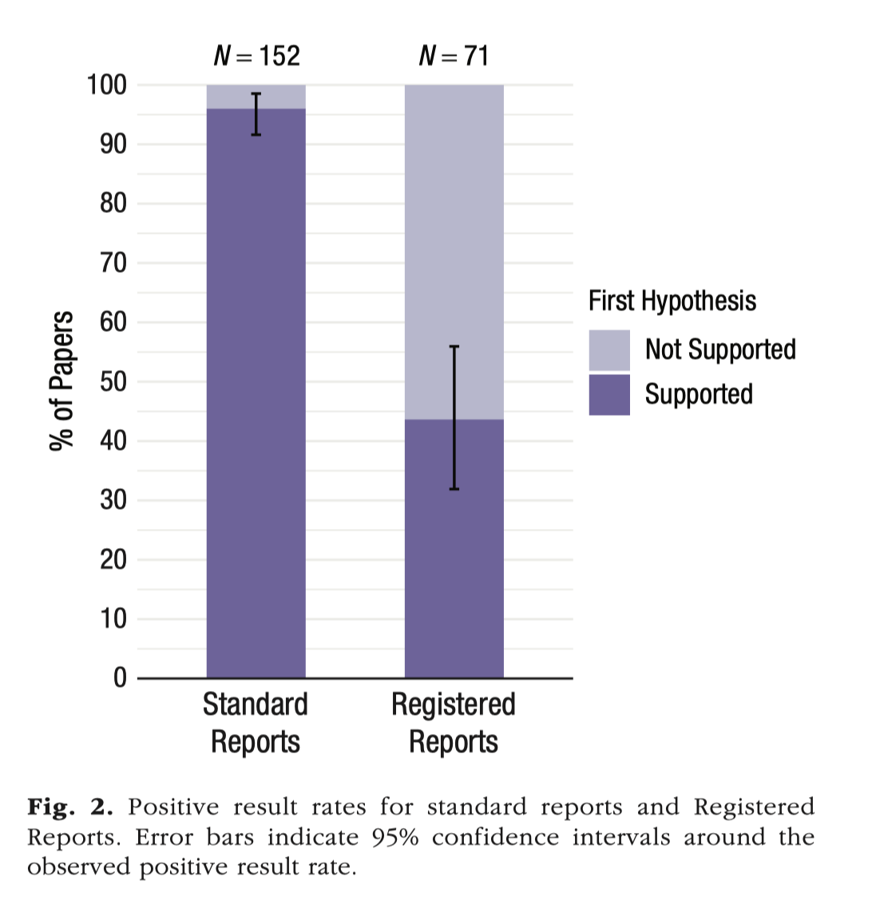
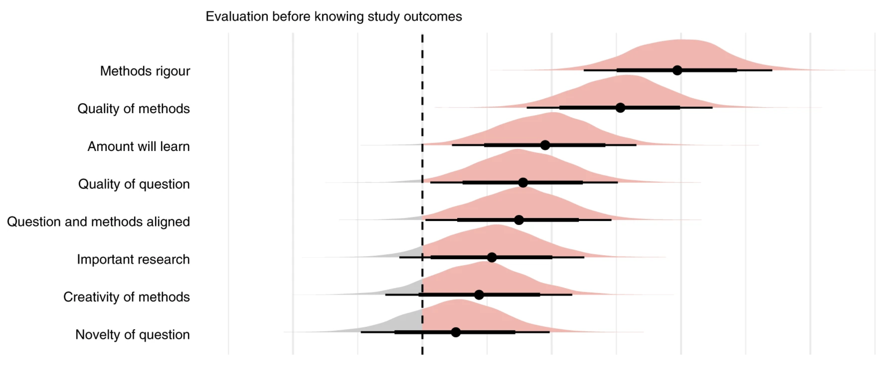

## Research process cycle

{fig-align="center"}

## 

```{=html}
<iframe allowfullscreen frameborder="0" height="80%" mozallowfullscreen style="min-width: 500px; min-height: 355px" src="https://app.wooclap.com/events/FUZIGY/questions/69e9f03251a3e77a69fc085a" width="100%"></iframe>
```

## 

```{=html}
<iframe allowfullscreen frameborder="0" height="80%" mozallowfullscreen style="min-width: 500px; min-height: 355px" src="https://app.wooclap.com/events/FUZIGY/questions/69e9f0322666a56a4dcd18c9" width="80%"></iframe>
```

## Questionable research practices (QRPs)

{fig-align="center"}

## Preregistration

::: {.callout-note appearance="simple"}
Preregistration is the practice of publicly specifying a study's research questions/hypotheses, methods, and analysis plan in advance to control for analytic adequacy and increase transparency in research.
:::

. . .

::: {.callout-tip appearance="simple"}
-   You write a document with the plan.

-   You upload it to a preregistration service (like OSF, aspredicted.org, ...)

-   It is time-stamped.
    You proceed with the study.
    No formal peer-review required.
:::

## Traditional publishing

{fig-align="center"}

## Registered Reports

{fig-align="center"}

## How to write an RR

::: callout-tip
## Stage 1 manuscript

-   Write **introduction, background and methods**.

-   Target **specific and clear** RQs (and RHs) and assess **feasibility** (within constraints).

-   **Pilot** studies or data **simulations**.

-   Prepare a **research compendium** and ensure **reproducibility**.
:::

. . .

::: callout-important
## In Principle Acceptance

Carry out the study according to the Stage 1 registered protocol.
:::

. . .

::: callout-tip
## Stage 2 manuscript

-   Write **results** (of registered analyses + optional exploratory non-registered analyses), **discussion** and **conclusion**.
:::

## Resources

::: {.callout-tip appearance="simple"}
-   See COS resources: <https://www.cos.io/initiatives/registered-reports>

-   @chambers2015, @chambers2021, @hardwicke2018, @karhulahti2022, @karhulahti2023, @lakens2024.
:::

## Proportion of negative results

{fig-align="center"}

## Not killing the vibe

{fig-align="center"}

## Guidance for PhD students

::: {.callout-note appearance="simple"}
-   **PhD students can benefit from RRs.**

-   First year is critical: conceptualisation and writing of RR Stage 1.

-   Time spent on preparing Stage 1 seems longer but time we should spend anyway.
    Overall time (from inception to publication) similar.

-   Stage 2 review is very quick.
    Most issues with traditional review are about things that should have been done, but it's too late.
:::

## Venues

::: {.callout-note appearance="simple"}
-   Subject specific journals that offer Registered Reports.

-   PCI RR: <https://rr.peercommunityin.org>.
:::

## Make your next study a Registered Report! {.center background-color="var(--inverse)"}

## References
